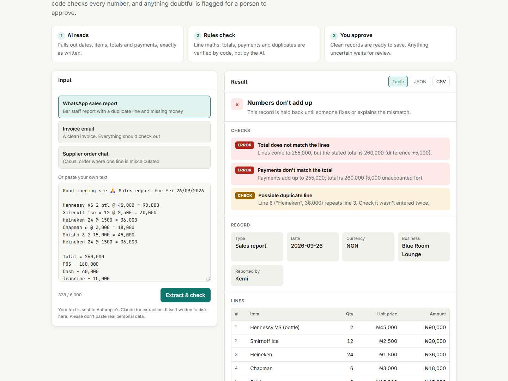
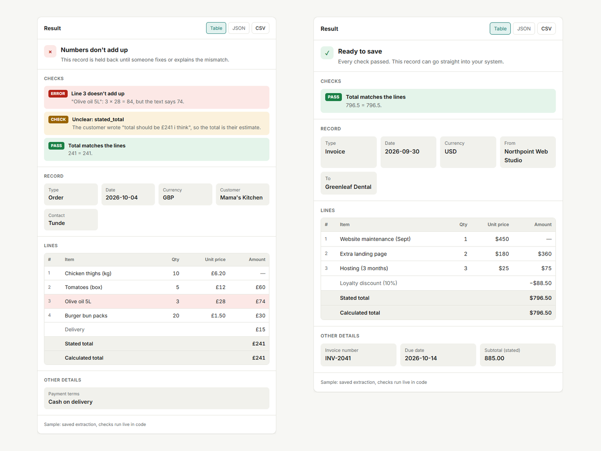

# AI data extraction with built-in checks

**Live demo:** https://extract.frankonline.cloud

Paste a messy WhatsApp sales report, invoice email or supplier order chat. Claude extracts a structured record **exactly as written**, then plain code checks every number. Anything doubtful is flagged for a person instead of slipping into your books.



## The idea: AI reads, code checks, a person approves

LLMs are good at reading messy text and bad at being trusted with arithmetic. So the model is told to copy numbers as written and never fix them, and `checks.mjs` verifies:

- each line: quantity × unit price = amount
- lines + adjustments (discounts, tax, delivery) = stated total
- payments received = total (money unaccounted for is flagged)
- duplicate lines (the same item and amount entered twice)
- missing date, and anything the model itself marked uncertain

Each record comes out as **ready**, **needs review** or **blocked**.



## Stack

Node 22, Express 5, Anthropic SDK structured outputs (`messages.parse` + a Zod schema), plain HTML/CSS/JS, Docker + Caddy.

The three samples use saved extractions, so they cost nothing; the checks still run live on them. Custom text calls the API behind a proof-of-work check, a per-IP rate limit, a daily call and dollar cap, and an `AI_ENABLED` kill switch.

## Run it

```bash
npm install
cp .env.example .env   # add ANTHROPIC_API_KEY
node --env-file=.env server.mjs   # http://localhost:5180
node --test
```

Built by [Frank A.](https://www.upwork.com/freelancers/~0170dd39761ac49004), AI integration engineer.
